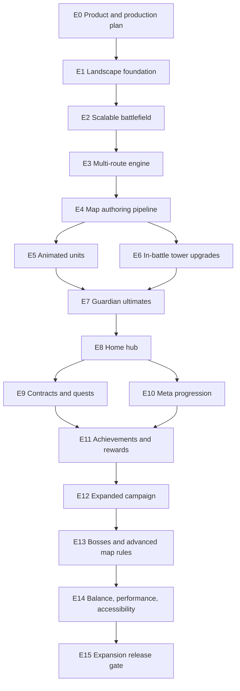

# Cat Guard Expansion RoadMap

Status: active source of truth for the post-MVP expansion

Started: 2026-07-21

Primary reference: `Bloons TD 6` systems, with `Kingdom Rush` presentation principles

Product rationale: [PRODUCT_REFERENCE_REPORT.md](PRODUCT_REFERENCE_REPORT.md)
External production work: [EXTERNAL_PRODUCTION_BACKLOG.md](EXTERNAL_PRODUCTION_BACKLOG.md)

## 1. Цель программы

Перевести текущий портретный MVP в полноценную горизонтальную tower-defense игру с большими картами, несколькими путями противников, анимированными существами, боевой прокачкой башен, масштабными ультимативными способностями и общим хабом между боями.

Итоговый продукт должен поддерживать:

- автоматический запуск в горизонтальной ориентации и поворот между `Landscape Left` / `Landscape Right`;
- крупные 16:9 и широкоформатные поля боя без потери safe area;
- несколько независимых маршрутов врагов на одной карте;
- анимационные состояния врагов, башен, снарядов и боссов;
- улучшение поставленных башен прямо в бою;
- глобальные “Guardian Ultimates”, способные менять ситуацию на всей карте;
- домашний хаб котов с мастерской, доской заданий, достижениями и прогрессией;
- награды после раундов и долгосрочные цели;
- офлайн-работу основной кампании и прогрессии;
- расширение контента без переписывания основных систем.

## 2. Что уже есть и что меняется

Текущая игра уже имеет:

- Unity 6 LTS Android-проект;
- `Boot -> MainMenu -> Level`;
- 10 портретных уровней;
- 5 башен и 5 врагов;
- одиночный `Vector2[] pathPoints` в `LevelConfig`;
- башни, врагов, волны и уровни в `ScriptableObject`;
- локальный JSON save;
- постоянные процентные улучшения;
- daily rewards / daily missions;
- fake/no-SDK analytics и rewarded-ad boundaries;
- Android build и emulator QA tooling.

Новая программа **не выбрасывает** этот фундамент. Она поэтапно мигрирует его:

- портретный `540 x 1200` UI превращается в адаптивный landscape shell;
- одиночный массив точек превращается в коллекцию маршрутов;
- статичный спрайт получает animation presentation layer;
- постоянные проценты дополняются тактическими боевыми ветками;
- `MainMenu` превращается в домашний хаб;
- daily missions становятся частью общей системы заданий;
- save получает явную версию и миграции.

## 3. Новое правило выполнения и тестирования

### 3.1 Единица работы — крупный завершённый раздел

Каждый раздел `E0`–`E15` ниже является отдельным большим блоком. Нельзя начинать следующий раздел, пока текущий не достиг всех exit criteria.

### 3.2 Runtime-тесты выполняются только на границе раздела

Пока раздел реализуется:

- не запускаем промежуточные ручные игровые сценарии;
- не запускаем эмулятор ради каждого небольшого изменения;
- не считаем отдельный файл или маленький commit завершением раздела;
- допускаем только безопасные статические проверки, инспекцию diff и проверки целостности данных, если они не запускают приложение.

Когда весь раздел готов:

1. выполняется один полный block test gate;
2. исправляются найденные дефекты внутри этого же раздела;
3. обновляется отчёт раздела;
4. создаётся Conventional Commit;
5. commit сразу отправляется в `origin/develop`;
6. проверяется `develop == origin/develop`;
7. только после этого можно начинать следующий раздел.

### 3.3 Исключения

- Документационный блок проверяется `git diff --check`, ссылками и согласованностью документов, без Unity/эмулятора.
- Если Unity нужен исключительно для корректной сериализации `.unity` / `.asset`, это инструмент создания файла, а не gameplay QA. Полный runtime gate всё равно остаётся в конце раздела.
- Если раздел невозможно безопасно завершить без раннего наблюдения runtime, работа останавливается и причина документируется; тестирование не маскируется под “техническую проверку”.

## 4. Карта зависимостей

## 5. Программа по вехам

| Веха | Разделы | Игровой результат |
|---|---|---|
| A — Landscape Foundation | `E0`–`E4` | Горизонтальное приложение, масштабное поле, несколько маршрутов и удобное создание карт |
| B — Tactical Combat | `E5`–`E7` | Анимированные враги, боевые ветки башен и глобальные ульты |
| C — Home And Progression | `E8`–`E11` | Хаб, задания, долгосрочная прокачка, достижения и награды |
| D — Content Expansion | `E12`–`E15` | Новая кампания, боссы, баланс, оптимизация и готовая expansion-сборка |

## E0 — Product Direction And Production Plan

Status: completed by this documentation task.

### Цель

Зафиксировать ориентир, границы оригинальности, крупные блоки, порядок зависимостей, новое правило тестирования и внешний production backlog.

### Результаты

- выбран основной референс и описаны ограничения сравнения;
- создан этот RoadMap;
- создан отдельный список ассетов и внешних работ;
- зафиксировано, что runtime QA запускается только после завершения большого раздела;
- следующий кодовый раздел однозначно определён как `E1`.

### Test gate E0

- только документационные проверки;
- Unity, APK и эмулятор не запускаются;
- все относительные ссылки должны вести на существующие документы;
- изменения должны быть закоммичены и отправлены в `develop`.

## E1 — Landscape Foundation And Automatic Rotation

Размер: `XL`

Статус: завершён 2026-07-21; реализация и Block Test Gate зафиксированы в [E1_LANDSCAPE_REPORT.md](E1_LANDSCAPE_REPORT.md).

Главный результат: приложение запускается в landscape и всё существующее MVP-поведение помещается в новую композицию.

### Scope

1. Перевести Android Player Settings на `Auto Rotation`.
2. Разрешить только `Landscape Left` и `Landscape Right`.
3. Запретить `Portrait` и `Portrait Upside Down`.
4. В bootstrap явно установить:
   - `Screen.autorotateToLandscapeLeft = true`;
   - `Screen.autorotateToLandscapeRight = true`;
   - portrait flags в `false`;
   - `Screen.orientation = ScreenOrientation.AutoRotation`.
5. Сделать запуск предсказуемым даже если устройство физически лежит вертикально.
6. Заменить портретные design constants `540 x 1200` на единый landscape layout contract.
7. Разделить поле боя и HUD:
   - центральное поле;
   - верхняя компактная status bar;
   - нижняя или боковая tower tray;
   - безопасная result overlay;
   - области под системные вырезы и жестовую навигацию.
8. Перестроить Main Menu в landscape без изменения его текущих функций.
9. Адаптировать фон, панели, модальные окна, privacy screen и scroll areas.
10. Обновить Android validation scripts, где сейчас ожидается portrait.
11. Пометить старые portrait store screenshots как legacy; новые не создавать до завершения expansion UI.

### Layout contract

- Базовое соотношение для дизайна: `1920 x 1080`.
- Минимальный логический viewport: `1280 x 720`.
- Поддерживаемые классы экранов:
  - `16:9` phones;
  - `18:9`–`21:9` wide phones;
  - `4:3` и близкие landscape tablets;
  - cutout / rounded-corner safe areas.
- UI масштабируется по высоте, но использует расширяющиеся side gutters.
- Поле боя не растягивает world units; камера кадрирует карту по данным уровня.
- Кликабельная область не меньше 48 logical dp-equivalent.

### Предполагаемые системы

- `ProjectSettings/ProjectSettings.asset` через корректный Unity workflow;
- `GameBootstrap` или отдельный `OrientationService`;
- `MainMenuController`;
- `PrototypeHud`;
- build/settings validators;
- landscape background and layout resources;
- planning and store documentation.

### Не входит

- увеличение карты;
- несколько путей;
- новые башни или враги;
- финальный hub redesign;
- новые store screenshots;
- физическое устройство, пока оно недоступно.

### Exit criteria

- нет портретных design constants в активном MainMenu/HUD layout;
- orientation policy находится в одном понятном месте;
- portrait directions запрещены, обе landscape directions разрешены;
- текущие меню, бой, победа, поражение, daily, upgrades, settings и privacy доступны в landscape;
- нет обрезанных основных действий на целевых aspect ratios;
- документация больше не называет активный продукт портретным.

### Block test gate E1

Только после завершения всего scope:

- Unity batch validation / compile;
- Android QA build;
- запуск эмулятора, изначально установленного в portrait;
- подтверждение автоматического перехода приложения в landscape;
- rotation `Landscape Left -> Landscape Right -> Landscape Left`;
- MainMenu, Daily, Upgrades, Privacy, Level, result overlay;
- скриншоты 16:9 и wide-phone viewport;
- отсутствие новых `Unity` / `AndroidRuntime` critical errors.

## E2 — Scalable Battlefield, Camera, And Larger Maps

Размер: `XL`

Статус: завершён 2026-07-21; полный Block Test Gate зафиксирован в [E2_BATTLEFIELD_REPORT.md](E2_BATTLEFIELD_REPORT.md).

Главный результат: карта становится отдельной конфигурацией мира и может быть заметно больше текущего портретного поля.

### Scope

1. Ввести явные данные карты:
   - world bounds;
   - camera bounds;
   - background / biome id;
   - placement zones;
   - blocked zones;
   - decoration anchors;
   - path visual width;
   - spawn/goal presentation anchors.
2. Отделить `LevelConfig` от геометрии карты через `BattlefieldConfig` или эквивалентный config boundary.
3. Реализовать camera framing для разных размеров карты.
4. Поддержать два класса карт:
   - `Fixed Overview`: вся карта помещается на экран;
   - `Scrollable Large`: карта больше viewport и допускает ограниченный pan.
5. Масштабировать placement grid в world-space, а не через портретные координаты.
6. Добавить obstacle / no-build zones.
7. Сделать карту слоистой:
   - background;
   - terrain;
   - route;
   - props below units;
   - units/projectiles;
   - props above units;
   - VFX;
   - world indicators.
8. Создать 3 landscape vertical-slice layouts из существующих тем:
   - Garden Gate Wide;
   - Old Well Crossing;
   - Rooftop Moonline.
9. Сохранить fallback presentation для отсутствующих финальных ассетов.

### Camera rules

- Башня не размещается во время camera drag.
- Pan не выводит battlefield за camera bounds.
- Pinch zoom может быть добавлен только если overview при минимальном масштабе остаётся читаемым.
- UI остаётся screen-space и не двигается вместе с камерой.
- Spawn/goal warnings видимы даже возле safe-area edges.

### Data migration

- Старые 10 уровней продолжают загружаться через legacy adapter или одноразовую migration utility.
- Нельзя вручную дублировать одну и ту же геометрию в нескольких контроллерах.
- Новые координаты хранятся в config assets, не в UI.

### Exit criteria

- минимум 3 landscape layouts существуют как валидные config assets;
- одна карта заметно шире текущего поля и использует camera bounds;
- placement, targeting, projectiles, VFX, spawn и goal работают в новом world scale;
- старый одиночный уровень можно открыть через compatibility path;
- карта не зависит от `540 x 1200`.

### Block test gate E2

- Unity config validation;
- 3 карты в эмуляторе;
- pan boundary / tap-vs-drag scenarios;
- установка башен у всех краёв карты;
- победа/поражение на fixed и scrollable карте;
- visual evidence на 16:9 и wide landscape;
- FPS baseline для большой карты без финальной анимации.

## E3 — Multi-Route Enemy Path Engine

Размер: `XL`

Статус: завершено; полный Block Test Gate пройден и зафиксирован в [E3_MULTI_ROUTE_REPORT.md](E3_MULTI_ROUTE_REPORT.md).

Главный результат: карта поддерживает несколько одновременных путей, и волны явно решают, по какому маршруту идёт каждый spawn.

### New data contract

Предлагаемый `PathRouteConfig`:

- `routeId`;
- `displayName` / localization key;
- ordered points or segments;
- spawn anchor;
- goal anchor;
- visual style id;
- route weight;
- optional tags (`ground`, `air`, `burrow`, `boss`);
- optional delay/offset;
- validation metadata.

`LevelConfig` или `BattlefieldConfig` хранит `PathRouteConfig[]`, а wave spawn entry хранит:

- explicit `routeId`;
- либо deterministic route-selection rule;
- запрещён неявный случайный выбор без seed/config.

### Scope

1. Заменить single-path assumptions во всём runtime.
2. Передавать выбранный маршрут каждому врагу при spawn.
3. Рассчитывать normalized progress для targeting независимо от длины маршрута.
4. Поддержать:
   - общий spawn и разные развилки;
   - разные spawn и общий goal;
   - полностью отдельные lanes;
   - пересекающиеся визуально маршруты без смены lane;
   - boss-only route.
5. Отрисовывать каждый путь и его направление.
6. Показывать предупреждение о новой волне возле правильного spawn.
7. Сделать tower targeting lane-agnostic.
8. Учитывать route в analytics/fake analytics payload.
9. Валидировать уникальность route ids и корректность wave references.
10. Мигрировать legacy `pathPoints` в route `main`.

### First content target

- 1 однопутная landscape карта как control;
- 1 карта с двумя отдельными путями;
- 1 карта с развилкой и общим goal;
- минимум одна волна одновременно спавнит врагов на двух маршрутах.

### Exit criteria

- runtime не обращается напрямую к единственному `config.PathPoints`;
- все route references валидируются до начала боя;
- враги не перескакивают между путями на пересечениях;
- tower targeting корректно сравнивает угрозу на разных routes;
- defeat condition учитывает любой goal;
- VFX и предупреждения используют правильный route endpoint.

### Block test gate E3

- Unity route/config validation;
- однопутная regression map;
- two-lane simultaneous wave;
- forked-route map;
- boss-only route data check;
- победа и поражение через каждый route;
- targeting “first/last/strong” при врагах на разных длинах путей;
- save/restart между уровнями, но не посреди боя, если mid-battle save не добавлялся.

## E4 — Map Authoring And Content Validation Pipeline

Размер: `L`

Статус: завершён; полный Block Test Gate записан в [E4_MAP_AUTHORING_REPORT.md](E4_MAP_AUTHORING_REPORT.md).

Главный результат: новые масштабные карты создаются через данные и инструменты, а не ручные изменения runtime-кода.

### Scope

- Scene/Game view gizmos для routes, bounds, placement и blocked zones.
- Route point handles или документированный Unity Editor workflow.
- Автоматическая проверка:
  - минимум 2 точки на route;
  - уникальные ids;
  - точки внутри world bounds или осознанное исключение;
  - spawn entries с существующим route;
  - goal reachability;
  - placement cells не пересекают path/no-build zones;
  - camera bounds покрывают обязательные объекты;
  - towers/enemies/waves не имеют missing references.
- Preview action для визуализации путей без запуска полного боя.
- Legacy-to-multi-route migration helper.
- Карточка дизайна карты с полями:
  - intended difficulty;
  - route concept;
  - tower-role opportunities;
  - dominant threat;
  - ultimate opportunities;
  - accessibility notes.

### Exit criteria

- новый уровень можно собрать без изменения gameplay scripts;
- validator выдаёт понятные ошибки с asset path;
- 3 vertical-slice карты проходят validator;
- документирован повторяемый authoring workflow;
- runtime не содержит map-specific `if (levelId == ...)` для геометрии.

### Block test gate E4

- validator success на 3 новых картах;
- намеренно повреждённые копии ловят каждую критическую категорию;
- editor preview визуально совпадает с runtime route;
- одна новая тестовая карта собирается по инструкции с нуля;
- emulator smoke всех 3 карт после завершения блока.

## E5 — Animated Enemies And Unit Presentation

Размер: `XL` плюс external art dependency

Главный результат: враги имеют единый state-driven animation layer и больше не выглядят движущимися статичными карточками.

### Runtime states

- `Spawn`;
- `Idle`;
- `Walk`;
- `Hit`;
- `Attack` или `GoalAttack`, если применимо;
- `Ability` для специальных врагов;
- `Death`;
- `Stun/Frozen` overlay или state modifier.

### Scope

1. Создать `UnitAnimationConfig` / presentation profile.
2. Отделить combat state от Animator implementation.
3. Поддержать sprite-sheet Animator как baseline.
4. Сохранить static-sprite fallback для незавершённого ассета.
5. Настроить direction handling:
   - базово 4 направления;
   - допустимый horizontal flip только для симметричных моделей;
   - diagonal movement использует ближайшее направление до появления 8-direction art.
6. Синхронизировать скорость walk animation с movement speed в разумных пределах.
7. Добавить hit flash, shadow, health/status indicators без скрытия силуэта.
8. Ввести sorting policy на пересечениях маршрутов.
9. Добавить animation events только через безопасные presentation hooks; урон не должен зависеть от отсутствующего визуального event.
10. Интегрировать 5 текущих врагов.

### Content target

- `Mouse Scout`: быстрый лёгкий walk/death;
- `Rat Bruiser`: тяжёлый шаг и сильный hit reaction;
- `Snail Tank`: медленное движение, shell defense cue;
- `Moth Swarm`: hovering loop и scatter death;
- `Beetle Guard`: armored walk, block/armor-break cue.

### Exit criteria

- все 5 врагов используют общий animation contract;
- combat продолжает работать при missing animation clip;
- death animation не наносит дополнительный урон и не блокирует wave completion;
- direction changes не создают заметного sprite popping сверх документированного fallback;
- финальные или временные animation assets имеют источник и лицензионный статус.

### Block test gate E5

- все состояния каждого врага в controlled showcase;
- обычный бой на 3 картах и двух routes;
- slow/fast modifiers;
- массовая волна и object cleanup;
- sorting at crossings;
- profiler/FPS comparison против E4 baseline;
- no missing clips / Animator warnings.

## E6 — In-Battle Tower Upgrade Trees

Размер: `XL`

Главный результат: игрок улучшает уже поставленную башню во время боя и выбирает её тактическую роль.

### Product rule

Первая завершённая версия использует **2 ветки по 3 уровня** для каждой из 5 текущих башен. Архитектура допускает третью ветку и пять уровней позже, но контент не раздувается до BTD6 parity в первом блоке.

### Data contract

`TowerUpgradeTreeConfig`:

- tower family id;
- branch ids and localization;
- tier nodes;
- price;
- prerequisites;
- mutually exclusive rules;
- stat modifiers;
- behavior modifier / projectile override;
- presentation override;
- optional activated ability;
- sell value contribution.

### Initial branch concepts

| Tower | Branch A | Branch B |
|---|---|---|
| Dart | rapid multi-shot | precision/pierce |
| Bell | long-range marksman | area resonance/debuff |
| Blanket | larger blast | burn/control zone |
| Laser | chain beam | focused boss damage |
| Yarn | heavy impact | slow/snare support |

### Scope

- Tap tower -> selection panel in landscape.
- Current stats, range preview, targeting priority.
- Upgrade buttons with cost, effect summary, lock reason.
- Transaction through battle economy, not UI constants.
- Visual evolution per tier through presentation config.
- Sell action with explicit confirmation or safe short interaction.
- Analytics boundary for purchase/branch/tier.
- Permanent hub upgrades remain separate and cannot silently mutate upgrade prices in UI.
- Localization for names, effects, insufficient funds, max tier, branch lock.

### Balance principles

- Каждый tier меняет решение или заметный break point, а не только `+2%`.
- Ветка A и B имеют разные ситуации силы.
- Начальная башня остаётся полезной, но поздняя волна требует upgrades.
- Стоимость улучшения сравнима с альтернативой “поставить ещё одну башню”.
- Верхние tiers не доступны слишком рано.

### Exit criteria

- 5 башен имеют по 2 завершённые ветки x 3 tiers;
- UI показывает фактические config values;
- branch lock и prerequisites детерминированы;
- upgrade меняет runtime behavior и presentation;
- бой можно выиграть разными ветками;
- старые permanent upgrades продолжают работать через отдельный слой.

### Block test gate E6

- полный upgrade path каждой ветки;
- insufficient funds / max tier / branch conflict;
- sell после upgrades;
- target priority;
- upgrade во время высокой нагрузки;
- победа минимум двумя разными build strategies;
- save не сохраняет временные battle upgrades как permanent progress;
- analytics/fake event payload inspection.

## E7 — Guardian Ultimates And Map-Scale Abilities

Размер: `XL` плюс VFX/audio dependency

Главный результат: игрок имеет несколько заряжаемых способностей, которые заметно воздействуют на всю карту.

### Initial ultimates

1. **Yarn Meteor Shower** — серия больших ударов по выбранной области, splash damage и краткий stun.
2. **Catnip Moon** — вся карта замедляется, коты временно ускоряются, освещение и VFX показывают эффект.
3. **Nine Lives Ward** — защита goal, восстановление части lives или предотвращение нескольких прорывов по чётким правилам.

Названия рабочие и могут измениться после narrative/art review.

### System rules

- Способности задаются `UltimateConfig`.
- Заряд получается из понятных действий: kills, damage, wave completion или отдельного resource rule.
- Нельзя покупать обязательный заряд через forced ads.
- У каждой способности есть cooldown, targeting mode, duration, effect list и presentation profile.
- Gameplay effect завершается корректно даже если VFX/audio отсутствует.
- Time scale changes централизованы и не ломают UI/animations.
- Большой эффект не скрывает пути и critical warnings дольше допустимого.

### Scope

- landscape ultimate bar;
- charge feedback;
- area targeting preview;
- cancel target action;
- camera shake intensity setting;
- reduced-flash accessibility option;
- pooling for large VFX;
- boss immunities/resistances through configs;
- analytics events for ready/use/result.

### Exit criteria

- 3 ultimates полностью работают на fixed и scrollable maps;
- каждая способность полезна в разной тактической ситуации;
- эффект не зависит от animation event;
- экран остаётся читаемым;
- отсутствуют дублирующиеся rewards/charges после pause or result transition.

### Block test gate E7

- заряд каждого ultimate;
- use/cancel/invalid target;
- одновременные routes;
- взаимодействие со slow, stun, armor и boss immunity;
- pause/result transition во время эффекта;
- reduced flash / shake off;
- mass-wave FPS and memory;
- victory/defeat edge cases с `Nine Lives Ward`.

## E8 — Home Hub Foundation

Размер: `XL`

Главный результат: после боя игрок возвращается не в набор вкладок, а в понятный кошачий хаб.

### Hub zones

- **Campaign Gate** — выбор региона/карты и начало боя;
- **Workshop** — постоянные unlocks и tower mastery;
- **Quest Board** — задания и контракты;
- **Achievement Wall** — достижения и claim rewards;
- **Guardian Lodge** — активная loadout/ultimate configuration;
- **Daily Basket** — ежедневные награды;
- **Settings Corner** — звук, язык, accessibility, privacy.

### Architecture

- Решить, остаётся ли `MainMenu` одной сценой с state-driven panels или становится `HomeHub` scene.
- Навигация должна иметь единый route/state model.
- Back button закрывает modal/panel прежде чем выходить.
- Hub widgets читают state через meta services, не редактируют save напрямую.
- Notifications badges вычисляются централизованно.
- Hub animation не блокирует быстрый вход в кампанию.

### First visual scope

- 2D illustrated garden outpost;
- 5–7 интерактивных зон;
- небольшие ambient animations;
- коты/props могут использовать placeholder loops до финального external art delivery;
- никаких 3D, free-roam character controls или backend social spaces.

### Exit criteria

- все существующие MainMenu функции доступны из hub;
- после victory/defeat возврат ведёт в hub с понятным результатом;
- выбранная карта и rewards не теряются;
- badges корректно показывают claimable actions;
- layout работает на целевых landscape ratios.

### Block test gate E8

- first launch -> hub -> level -> result -> hub;
- каждая zone и back navigation;
- RU/EN text fit;
- safe areas / wide phones / tablet ratio;
- daily reward and settings regression;
- reset save from hub;
- no duplicated service initialization.

## E9 — Post-Round Contracts And Quest Board

Размер: `L`

Главный результат: после раунда игрок получает или продвигает задания, а в hub выбирает следующие цели.

### Quest types

- tutorial/story tasks;
- post-round contracts;
- daily tasks;
- weekly-like offline rotation, только если local-time risk принят;
- mastery challenges;
- map/route-specific objectives;
- optional challenge modifiers.

### Example contracts

- Победить, используя не больше трёх башен.
- Улучшить одну Dart tower до tier 3.
- Остановить 20 врагов эффектами slow/stun.
- Защитить обе дорожки без потери lives.
- Победить Rat Bruiser ultimate-способностью.
- Пройти карту без продажи башен.

### Data and rules

- `QuestConfig`, `QuestObjectiveConfig`, `QuestRewardConfig`;
- progress events проходят через quest service;
- claim отделён от completion;
- активные contracts ограничены понятным количеством;
- reroll либо бесплатный по правилам, либо отложен; rewarded reroll только voluntary;
- local clock manipulation risk документируется;
- impossible quest filters учитывают unlocked content.

### Exit criteria

- Quest Board показывает active/completed/claimed;
- минимум 12 contract configs и 6 objective types;
- progress обновляется по battle result events;
- после раунда есть короткий progress summary;
- reward выдаётся ровно один раз;
- старые daily missions либо мигрированы, либо работают через adapter.

### Block test gate E9

- каждый objective type;
- simultaneous progress нескольких quests;
- complete vs claim;
- app restart до/после claim;
- date rollover для daily;
- locked-content filtering;
- duplicate event/reward protection.

## E10 — Meta Progression And Guardian Growth

Размер: `XL`

Главный результат: hub даёт осмысленную долгосрочную прокачку, которая открывает варианты, но не уничтожает тактический баланс.

### Progression layers

1. **Player Rank** — общий опыт за завершённые бои и задания.
2. **Tower Mastery** — опыт семей башен, открывающий новые branch options/cosmetics, а не бесконечный damage multiplier.
3. **Guardian Loadout** — выбор доступных ultimates и небольших pre-battle perks.
4. **Workshop Research** — ограниченные постоянные улучшения с caps.
5. **Collection/Codex** — враги, башни, карты и достижения как discovery layer.

### Save migration

- Добавить explicit save schema version.
- Ввести последовательные migration steps.
- Сохранить текущие Fish Coins, completed/unlocked levels, daily state, settings и upgrades.
- Любая migration должна быть idempotent.
- До migration создаётся безопасная backup-копия local save, если платформа позволяет.
- Corrupt/unknown future version не должен молча перезаписываться.

### Economy rules

- Fish Coins остаются основной soft currency на первом этапе.
- Не добавлять premium currency без отдельного решения.
- Permanent power имеет diminishing returns / caps.
- Ключевые игровые опции открываются игрой, не рекламой.
- Rewarded ads могут ускорить необязательную награду, но не заменяют progression.

### Exit criteria

- schema version и migration path покрывают текущий save;
- rank/mastery/research/loadout отображаются в hub;
- минимум один unlock каждого слоя можно заработать;
- permanent upgrades не дублируют in-battle upgrade tree;
- reset and migration paths документированы.

### Block test gate E10

- clean save;
- migration current portrait-era save;
- partially complete save;
- corrupted save recovery;
- restart after every reward/unlock type;
- economy caps and insufficient funds;
- no battle-upgrade leakage into meta save.

## E11 — Achievements And Reward Claims

Размер: `L`

Главный результат: игра фиксирует долгосрочные достижения, показывает прогресс и выдаёт награды ровно один раз.

### Categories

- campaign;
- tower mastery;
- route control;
- ultimates;
- perfect defense;
- collection;
- secrets/humor;
- long-term totals.

### Initial set

Минимум 12 достижений, включая:

- первый clear;
- 10 completed maps;
- победа без потери lives;
- первый tier-3 tower;
- использование всех 3 ultimates;
- 1000 defeated enemies;
- победа на true multi-route map;
- claim 7 daily rewards;
- complete 10 contracts;
- discover all 5 initial enemies;
- победа над первым boss;
- hidden garden interaction.

### Data contract

- stable `achievementId`;
- localized title/description;
- hidden flag;
- progress target;
- event-driven progress rule;
- reward bundle;
- completed timestamp/date key if needed;
- claimed flag;
- presentation tier/category.

### Exit criteria

- progress может быть incremental и one-shot;
- claim reward защищён от повторов;
- retroactive achievements вычисляются там, где source data надёжен;
- hidden achievements не раскрывают условие до completion;
- hub badge показывает claimable rewards;
- analytics boundary не содержит персональных данных.

### Block test gate E11

- все 12 conditions;
- partial progress;
- multiple completions in one result;
- restart before claim;
- repeated claim attempts;
- reset save;
- RU/EN presentation and hidden states.

## E12 — Expanded Landscape Campaign

Размер: `XXL` content block

Главный результат: новая система доказывается полноценной кампанией, а не одним technical demo.

### Content ladder

#### Vertical slice target

- 3 polished landscape maps;
- 1 true multi-route map;
- 5 tower families with upgrades;
- 5 animated enemy families;
- 3 ultimates;
- complete hub/quest/achievement loop.

#### First expansion target

- 12 landscape campaign maps;
- 3 biomes по 4 карты;
- 8–10 enemy families;
- 2 mini-bosses и 1 main boss;
- минимум 4 distinct route topology patterns;
- normal + one challenge modifier per completed map.

#### Long-term target

- 30+ handcrafted maps;
- 5+ biomes;
- additional tower families;
- third branch / higher tiers only after balance proof;
- rotating offline challenges from shipped config pools.

### Proposed biomes

1. **Backyard Dawn** — ворота, теплица, колодец, изгороди.
2. **Moonlit Rooftops** — крыши, водостоки, фонари, птицы/моли.
3. **Pantry Underpass** — кладовые, трубы, мышиные тоннели, multiple entrances.
4. Later: **Winter Greenhouse**, **Harbor Fish Market**, **Clockwork Workshop**.

### Per-map design checklist

- unique tactical sentence;
- readable route entrances and goals;
- 2–4 meaningful high-value placement zones;
- at least one reason to choose different tower branches;
- ultimate opportunity without making ultimate mandatory;
- no-build obstacles with visual logic;
- difficulty and reward budget;
- quest hooks;
- achievement hook only when appropriate;
- performance budget;
- external asset manifest.

### Exit criteria

- 12 maps pass authoring validator;
- campaign unlock graph is consistent;
- each biome has clear visual/tactical identity;
- difficulty ramp is documented;
- map-specific mechanics use configs/components, not controller id checks;
- content credits/licenses are complete.

### Block test gate E12

- clean-save campaign traversal through all 12 maps;
- every route and challenge modifier;
- unlock/reward/replay behavior;
- progression pacing sample;
- emulator performance on easiest and heaviest maps;
- visual evidence per biome;
- no missing localization/assets/config references.

## E13 — Bosses And Advanced Map Rules

Размер: `XL`

Главный результат: кампания получает крупные кульминации и меняющиеся тактические условия.

### Boss framework

- phase-based health thresholds;
- route and movement rules;
- telegraphed abilities;
- armor/status resistance configs;
- spawn support waves;
- environmental interactions;
- ultimate resistance, но не полная неуязвимость без ясной причины;
- boss UI and accessibility cues;
- deterministic cleanup and victory trigger.

### Advanced map rule examples

- открывающийся второй вход;
- временно затопленная placement zone;
- moving obstacle / gate;
- route switch между волнами, но не непредсказуемо внутри enemy movement;
- darkness/fog with readable counterplay;
- destructible cover;
- escort target or dual goal only after base system is stable.

### Exit criteria

- 1 main boss и 2 mini-bosses имеют разные mechanics;
- минимум 3 advanced map rules data-driven;
- telegraphs читаются на wide и tablet landscape;
- boss fight не зависит от frame-perfect input;
- map rule cleanup работает при victory, defeat, restart, quit.

### Block test gate E13

- каждая boss phase;
- all ultimates against each boss;
- restart/quit during transition;
- status immunity feedback;
- low-FPS behavior;
- advanced rule activation/deactivation;
- memory cleanup across repeated fights.

## E14 — Balance, Performance, Accessibility, And Polish

Размер: `XL`

Главный результат: все новые системы работают как единый продукт на целевом Android hardware profile.

### Balance

- battle economy curve;
- upgrade branch pick rates in controlled QA data;
- enemy effective health/speed/armor budgets;
- route pressure budgets;
- ultimate charge cadence;
- hub reward cadence;
- achievement and quest reward caps;
- no mandatory ad dependency.

### Performance budgets

- target `60 FPS` on mid-range device where realistic;
- acceptable floor documented for low-end profile;
- pooled enemies/projectiles/VFX;
- animation texture atlas budgets;
- no unbounded allocations per frame;
- map decorations have batching/sorting policy;
- worst-case mass-wave scenario is defined.

### Accessibility and UX

- reduced camera shake;
- reduced flashes;
- color-independent route warnings;
- scalable text within supported range;
- pause and speed control decision;
- clear cooldown/charge state;
- one-handed expectation removed from landscape docs;
- back navigation consistent;
- RU/EN fit and terminology pass.

### Polish

- final audio mix;
- hub ambience;
- upgrade/ultimate impact cues;
- enemy readability at normal zoom;
- transitions that do not delay replay;
- tutorial rewrite for landscape, multi-route, upgrades, and ultimate use.

### Exit criteria

- no known critical flow blocker;
- all required accessibility toggles persist;
- worst-case map meets agreed performance floor;
- balance report covers all 12 maps and five tower families;
- tutorial teaches new systems without text overload;
- no forced interstitial code exists.

### Block test gate E14

- full emulator regression suite updated for landscape;
- worst-case performance scenario;
- repeated long session;
- all settings persistence;
- RU/EN tutorial and hub;
- offline mode;
- save migration regression;
- optional physical device only if available, otherwise explicitly deferred.

## E15 — Expansion Release Gate

Размер: `L`

Главный результат: готовая Android expansion candidate, а не набор незавершённых систем.

### Scope

- version/package review;
- privacy and Data Safety re-audit against actual SDKs;
- new landscape icon/feature/screenshot review where needed;
- signed AAB workflow without committed secrets;
- migration/release notes;
- known-issues document;
- closed-testing scenario list;
- real-device test when owner can connect device;
- final source and asset license audit.

### Exit criteria

- all prior block reports complete;
- no incomplete external `P0` asset blocks;
- build is reproducible;
- clean install and upgrade install both documented;
- save migration from current public/QA build verified;
- store listing reflects landscape product;
- release decision records remaining risks honestly.

### Block test gate E15

- clean APK/AAB build;
- clean install;
- upgrade install with existing save;
- offline full first-session loop;
- landscape rotation policy;
- campaign/hub/quests/achievements;
- performance and crash checks;
- physical-device QA if a device is connected;
- final `develop == origin/develop` verification.

## 6. Cross-Cutting Architecture Rules

### Config-first

- towers, enemies, routes, levels, upgrades, ultimates, quests, achievements, rewards, hub zones and economy remain config-driven;
- UI may format values but does not own balance;
- map-specific behavior uses reusable rule configs/components.

### Save safety

- every save format change increments schema version;
- migration is covered at its section gate;
- never silently discard a newer/unknown save;
- temporary battle state is not confused with meta state.

### Service boundaries

- analytics, ads, Firebase, IAP and future cloud functions remain behind wrappers;
- no backend is introduced by this RoadMap;
- no direct SDK calls from gameplay or hub panels.

### Presentation fallback

- gameplay remains functional with placeholder/static visuals;
- missing VFX/audio/animation is reported but cannot corrupt combat state;
- final external assets replace presentation configs without changing combat rules.

### Originality and licensing

- no copied commercial assets;
- no traced characters or map layouts;
- all third-party assets need license records;
- generated assets need source prompt/tool/license provenance when kept.

## 7. Content Budgets For The First Expansion

| System | Minimum complete target | Architectural ceiling without redesign |
|---|---:|---:|
| Landscape maps | 12 | 30+ |
| Routes per map | 1–3 | 6 |
| Tower families | 5 | 12+ |
| Upgrade branches now | 2 | 3 |
| Upgrade tiers now | 3 | 5 |
| Enemy families | 8–10 | 30+ |
| Ultimates | 3 | 8 |
| Quest objective types | 6 | 20+ |
| Initial achievements | 12 | 100+ |
| Biomes | 3 | 6+ |
| Bosses | 3 total | config-driven expansion |

Ceilings здесь означают ожидаемую способность data model, а не обещание немедленно произвести весь контент.

## 8. Разделение ответственности

### Codex может выполнить самостоятельно

- architecture and C# implementation;
- Unity config/data contracts;
- editor validation tools;
- placeholder/procedural presentation;
- integration of supplied art/audio;
- localization structure;
- build automation;
- emulator QA at block gates;
- documentation, balance tables, migrations and release checklists.

### Требуется владелец или внешний специалист

- финальный character/concept art;
- production sprite animation or skeletal rigs;
- final VFX source art for complex ultimates;
- original music, SFX mastering and voice lines;
- store/legal/account decisions and credentials;
- Play Console actions;
- physical-device connection and subjective feel review;
- broad human playtesting and final fun/balance decision.

Подробные спецификации находятся в [EXTERNAL_PRODUCTION_BACKLOG.md](EXTERNAL_PRODUCTION_BACKLOG.md).

## 9. Next Action

`E13 — Bosses And Advanced Map Rules` завершён; фактический Unity/Android gate находится в [E13_BOSSES_ADVANCED_RULES_REPORT.md](E13_BOSSES_ADVANCED_RULES_REPORT.md), а authoring и runtime lifecycle описаны в [BOSS_AND_MAP_RULE_WORKFLOW.md](BOSS_AND_MAP_RULE_WORKFLOW.md).

Активный implementation block: **`E15 — Expansion Release Gate`**. E14 отмечен завершённым в task board и историческом отчёте; E15 начат с release tooling, версии `0.2.0`, store/privacy/license документов и воспроизводимого install/upgrade gate. Блок нельзя закрывать, коммитить или пушить как завершённый до финальных landscape captures, human playtest, physical-device QA, store/account inputs, полного block test gate и честного release decision.
